# IntelyIDE

<p align="center">
  <picture>
    <source media="(prefers-color-scheme: dark)" srcset="assets/brand/lockup-horizontal-dark.svg">
    
  </picture>
</p>

A desktop Git client for working across several repositories at once, with coding agents that are fenced off from committing and pushing by layered, best-effort protections.

[Install](#install) · [First run](#first-run) · [Safety model](#safety-model) · [Documentation](#documentation) · [Contributing](#contributing)

[](LICENSE)
[](https://github.com/ferencfarkas09/IntelyIDE/releases)
[](#requirements)

> [!NOTE]
> IntelyIDE 1.2.0 is a stable release. The installed app starts in normal (writable) mode: like any Git client it can commit, push and save files in the repositories you open, and agent runs can edit files there. The protections described under "Safety model" are layered and best-effort, not a guarantee, and the in-app enforcement chip reads "Weak" until you run the proof suite on your machine. Use it on repositories you can restore, and do not leave agents running unattended. When started from source with `pnpm dev:app` it is read-only instead (it refuses commits, pushes, saves, agent runs and network access).

<picture><source media="(prefers-color-scheme: dark)" srcset="docs/screenshots/changes-tree-dark.png">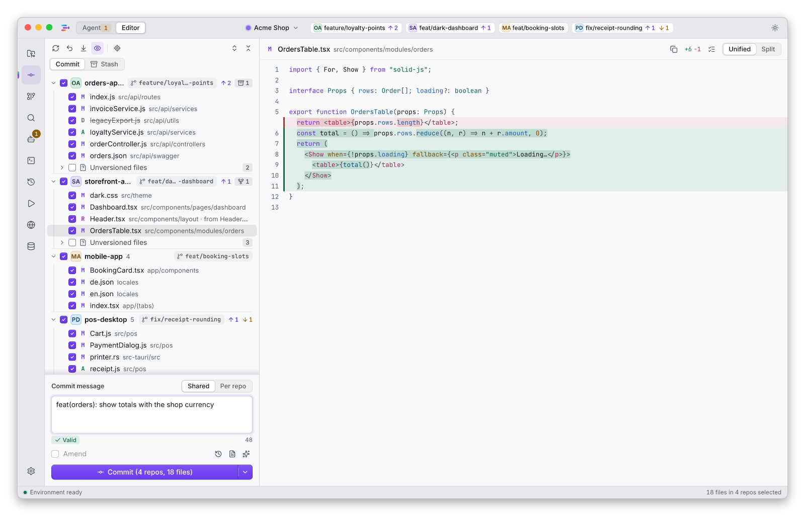</picture>

The screenshots show a fictional company on a generated demo workspace. The agent, approval and Rewind screens use a scripted demo provider, not a model; the window frame is drawn afterwards.

## Why IntelyIDE

A feature that touches an API, an admin UI and a mobile app usually means three or four Git windows and as many commits.

IntelyIDE shows the changed files of every open repository in one Changes tree.

1. Every row carries its repository badge, and every repository its branch.
2. Checkboxes are tri-state across repositories: tick a folder, a repository or one file.
3. Write one commit message for all selected repositories, or one message per repository.
4. Before a push you see what leaves each repository, and pushes to live branches (`main`, `master`, `production`, `release/*`) need a typed confirmation.

Agents are part of the same window, within limits:

| What | How |
|---|---|
| The agent can read and edit files in your registered repositories. | It asks you before anything outside its rules. |
| Layered, best-effort protections stop the agent from committing or pushing. | Policy hard stops on the agent's tool calls and host-side checks do the real work; a `git` shim adds a speed bump for accidental calls. They are not proven against a determined adversarial prompt. |
| A safety snapshot (Rewind) is taken before each run. | It covers tracked and untracked files that Git does not ignore, inside your repositories. Ignored files, anything outside the repositories and side effects such as installs or network calls are not covered, and a per-run opt-out exists. |

## Features

- **One Changes tree for many repositories.** Grouped by repository, with badges, branch pills, tri-state ticks, a shared or per-repository commit message and per-repository commit and push.
- **Git tools.** Hunk staging, log, blame, branch graph with merge lanes, split and unified diff, rebase, cherry-pick and stash.
- **Agent runs with five permission modes.** Plan, Ask, Accept edits, Automatic and Bypass. Automatic can use a lead agent with delegates (sub-agents with their own roles). Hard stops apply in every mode.
- **Rewind.** A snapshot of the working tree before each agent run, with a restore action per repository.
- **Approval drawer and history.** Permission requests, refusals and finished runs in one place.
- **Notes to a working agent.** Add something for the lead or a running subagent without stopping the run; the agent reads it with its next tool call, and the transcript shows whether it arrived.
- **Usage.** How much of your Claude plan's 5-hour session and 7-day week is left, and the tokens and API-equivalent cost of the runs this IDE started: by day, hour and model, with a year grid of busy days.
- **Agents on your own servers.** Run agents over `ssh` on a server you own, for example 3 on a build server and 2 on this Mac from one New run. The IDE sets the server up (Node.js, the agent files, the Agent SDK), the permission rules stay in the IDE and judge the server's files, and the git guard travels with each run. See [docs/remote-servers.md](docs/remote-servers.md).
- **Notifications.** A banner and a Dock count when a run needs a permission, asks a question, finishes or fails, with a switch for each and a limit on how often. See [docs/notifications.md](docs/notifications.md).
- **Built-in tools.** A small editor, a project tree, a terminal, and a preview with an element inspector.
- **53 languages.** English and Hungarian are written by hand. The other 51 are machine-translated and wait for native review; some newer screens (for example MongoDB Studio, workspaces and MCP settings) are not translated yet and show English there. See [docs/i18n.md](docs/i18n.md).

<details>
<summary>More modules (experimental, off by default)</summary>

- **Remote.** A phone view through a relay that you deploy on your own Cloudflare account. The project does not host a relay for you.
- **Sentry issues.** List the issues of one organization with filters and search, open the newest event with its stack and hand an issue to an agent ("Fix with agent"). It needs your own token and asks Sentry nothing until you add one; it has not been tried against a live Sentry server yet.
- **MongoDB Studio.** Browse collections with your own connections; credentials go to the macOS Keychain.
- **Happy integrations.** An optional module for one company's services (time tracker, chat, tasks). It is off by default, has no preset server, and is of no use to most people.
- **Other agent providers.** Providers other than Claude are proven only against test doubles.

</details>

<picture><source media="(prefers-color-scheme: dark)" srcset="docs/screenshots/push-confirm-dark.png">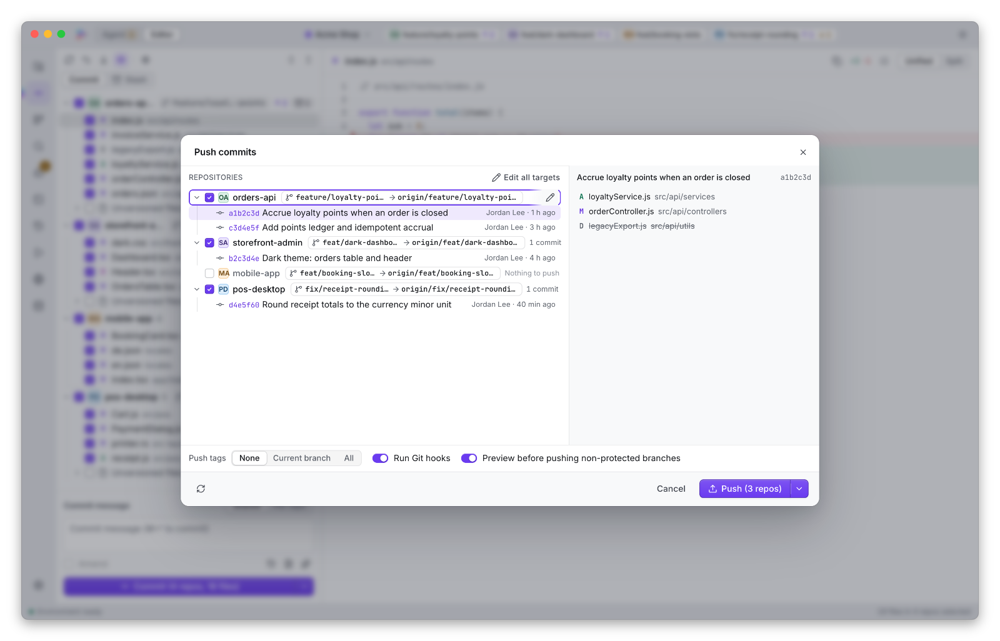</picture>

<picture><source media="(prefers-color-scheme: dark)" srcset="docs/screenshots/diff-graph-dark.png">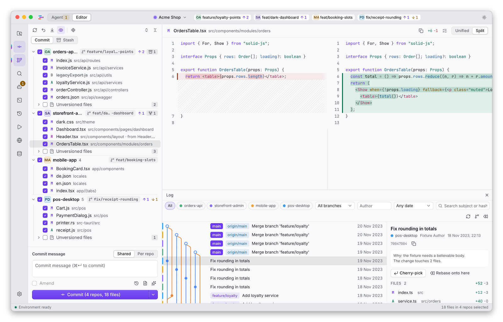</picture>

More screens. Each image follows your GitHub light or dark theme; select one for the full-size version.

| | |
|---|---|
| <a href="docs/screenshots/overview-light.png"><picture><source media="(prefers-color-scheme: dark)" srcset="docs/screenshots/overview-dark.png">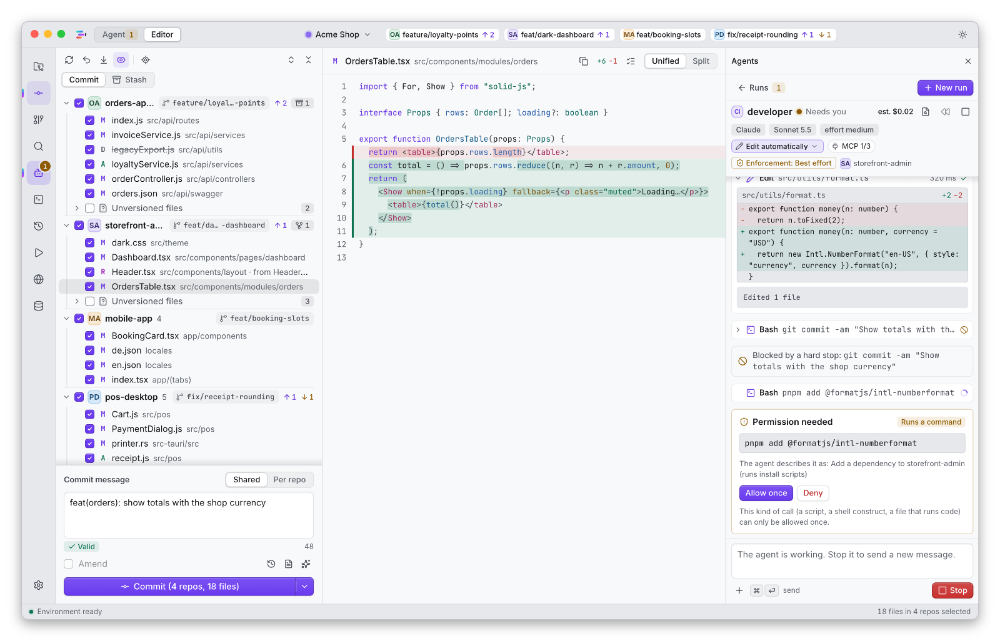</picture></a><br>Changes, editor and agent in one window. | <a href="docs/screenshots/palette-light.png"><picture><source media="(prefers-color-scheme: dark)" srcset="docs/screenshots/palette-dark.png">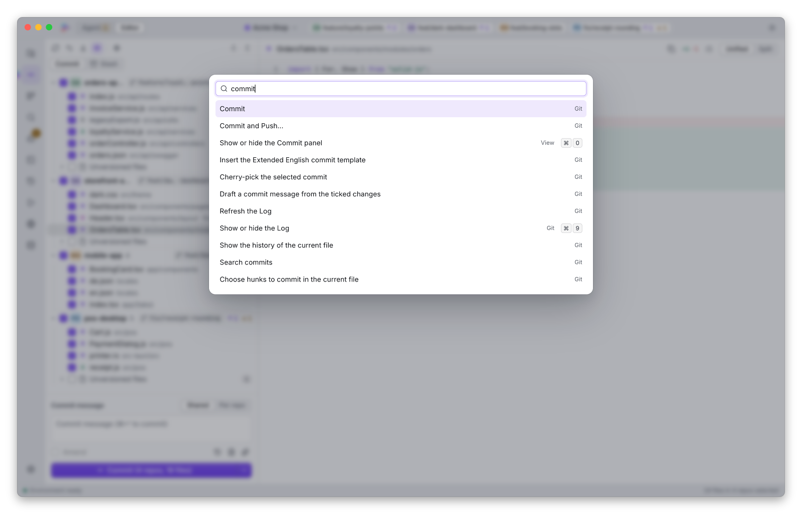</picture></a><br>Everything is one keystroke away. |
| <a href="docs/screenshots/preview-light.png"><picture><source media="(prefers-color-scheme: dark)" srcset="docs/screenshots/preview-dark.png">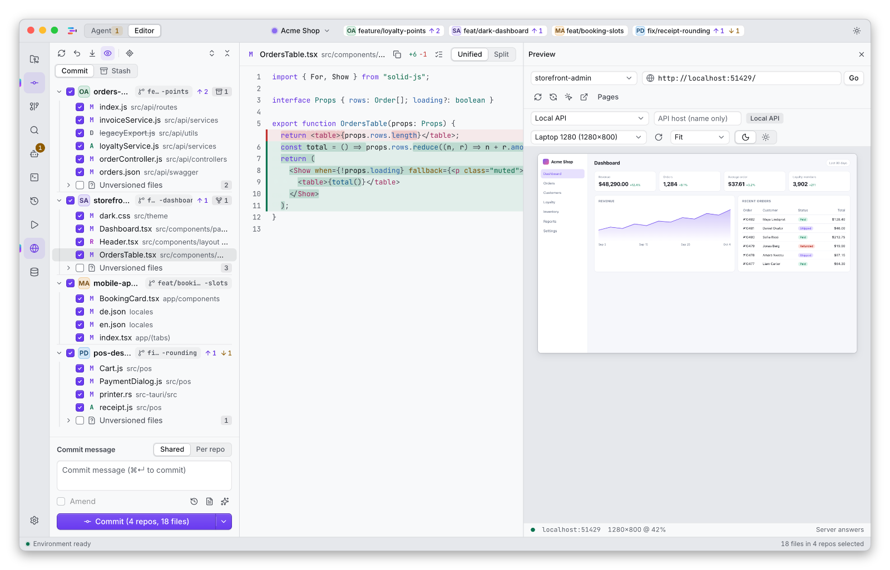</picture></a><br>Preview a running page and jump from an element to its source. | <a href="docs/screenshots/appearance-light.png"><picture><source media="(prefers-color-scheme: dark)" srcset="docs/screenshots/appearance-dark.png">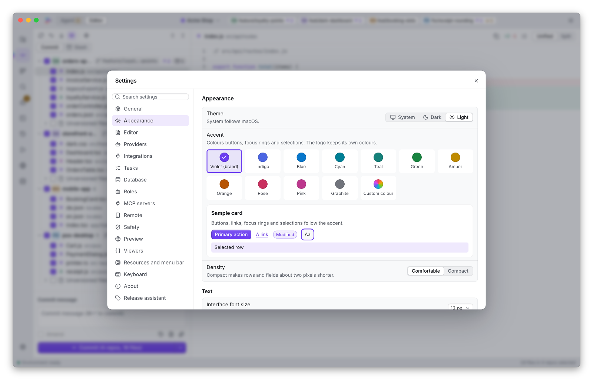</picture></a><br>Theme and accent colour. |
| <a href="docs/screenshots/providers-light.png"><picture><source media="(prefers-color-scheme: dark)" srcset="docs/screenshots/providers-dark.png">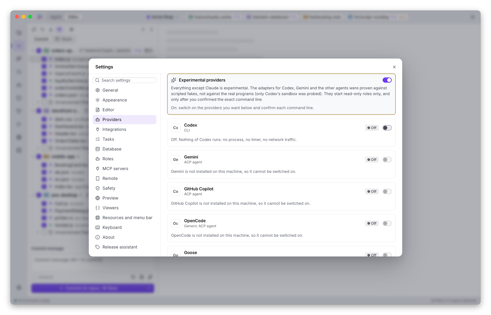</picture></a><br>Choose which agent providers may run. | <a href="docs/screenshots/api-contract-light.png"><picture><source media="(prefers-color-scheme: dark)" srcset="docs/screenshots/api-contract-dark.png">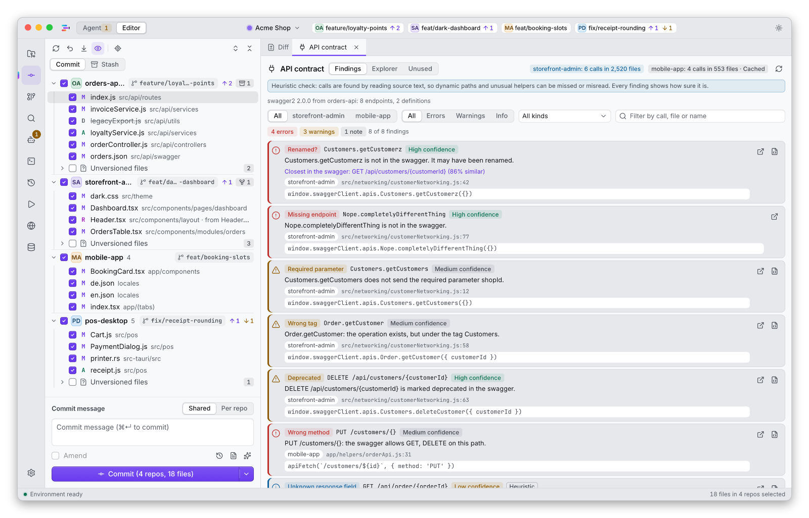</picture></a><br>Contract drift between the code and the API description. |
| <a href="docs/screenshots/remote-light.png"><picture><source media="(prefers-color-scheme: dark)" srcset="docs/screenshots/remote-dark.png">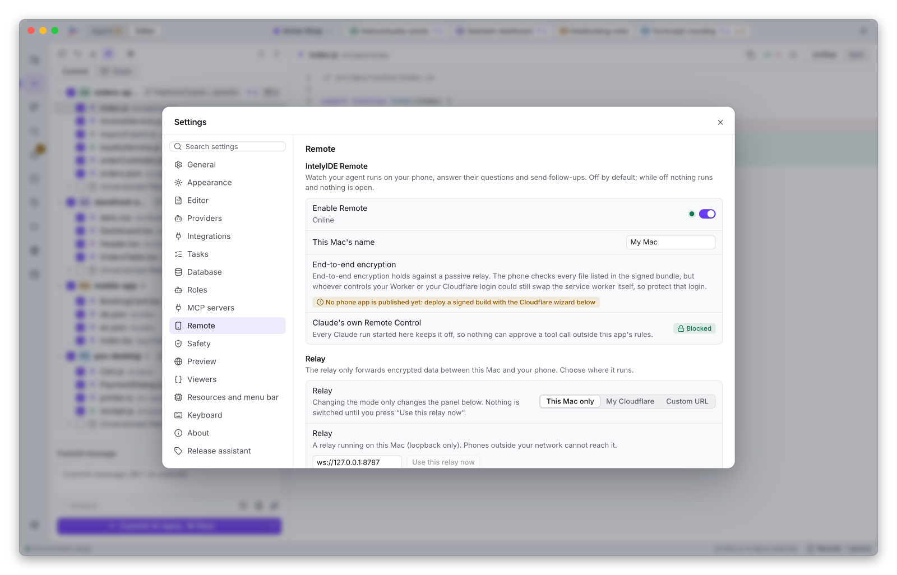</picture></a><br>Remote access is set up in your own Cloudflare account (experimental, off by default). | <a href="docs/screenshots/mongo-light.png"><picture><source media="(prefers-color-scheme: dark)" srcset="docs/screenshots/mongo-dark.png">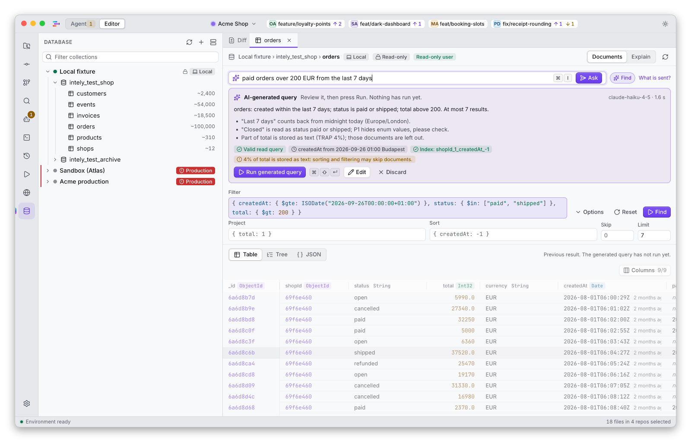</picture></a><br>Browse a collection in Mongo Studio (experimental, off by default). |

## Is it right for you?

It is meant for people who change several Git repositories for one piece of work and use Claude Code.

It is not for you if:

- you want a full code editor replacement;
- you want an agent to commit and push for you;
- you use Windows or Linux (macOS only);
- you need a notarized, supported product today.

## Safety model

In plain words:

1. **What an agent can do.** Read files, edit files inside repositories you registered, run read-only Git commands, and ask you for permission for anything else.
2. **What it is blocked from.** `commit`, `push`, merges, rebases, resets, checkouts, stashes and tags; editing `.git`, hooks (`.husky`), `.claude`, lockfile names and the IDE's own state directory. The path rules apply to the agent's file-edit tools. A program you approve when asked is not path-jailed. Common indirections (`npm run`, `make`, shell scripts) are read and checked, dynamic ones ask you, and an unknown program is not covered.
3. **How.** Policy hard stops on tool calls and host-side checks for agent-originated Git do the real work. The `git` shim on the agent's `PATH` is a speed bump that an absolute path such as `/usr/bin/git` walks around, so it does not count as a layer on its own. A read-only test jail exists for contributors. This is defence in depth, not one lock.
4. **Enforcement status.** The in-app chip reads "Weak" until you run the enforcement suite on your machine, and "Best effort" is the most it reports by default.
5. **Undo.** A Rewind snapshot (`refs/intely/snapshots/<run>`) is taken before each run. Ignored files (for example `.env`, build output), anything outside the repositories and protected files are not covered. A per-run opt-out exists and is off by default.
6. **Your own pushes.** Live branches need the exact branch name typed. Force pushes use a lease with `--force-if-includes`.
7. **Secrets.** Tokens you enter go to the macOS Keychain; if it refuses access, IntelyIDE falls back to memory and tells you. The run log keeps prompts, tool output and the contents of files the agent read, in plain text on your disk.
8. **Honest limits.** The hard stops are best-effort and unproven against a determined adversarial prompt. Unattended write mode on real repositories is not recommended. The agent runs with your account's file permissions. A run on a server is judged by the same rules in the IDE; what the server's own accounts can do is outside them (see [docs/remote-servers.md](docs/remote-servers.md)).
9. **Where your data goes.** IntelyIDE does not proxy agent traffic. Your own `claude` installation talks to Anthropic under your account.

<picture><source media="(prefers-color-scheme: dark)" srcset="assets/diagrams/safety-flow-dark.svg">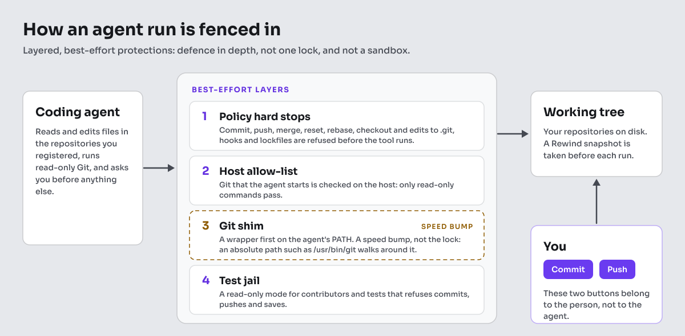</picture>

<picture><source media="(prefers-color-scheme: dark)" srcset="docs/screenshots/agent-approval-dark.png">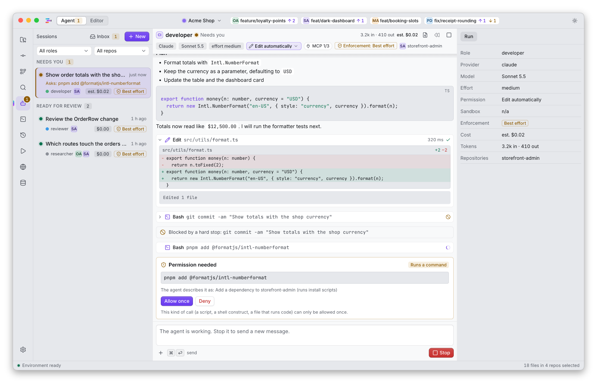</picture>

<picture><source media="(prefers-color-scheme: dark)" srcset="docs/screenshots/rewind-dark.png">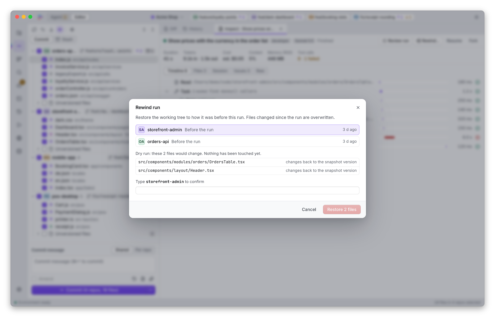</picture>

The full layer table, the enforcement suite and its results are in [docs/safety.md](docs/safety.md).

## Status and known limitations

This is version 1.2.0. It has been used mostly by its author, on an Intel Mac.

- Write mode is not judged suitable for unattended daily use on repositories you cannot restore.
- The agent protections are best-effort. See the safety model above.
- Providers other than Claude, Happy, MongoDB Studio and Remote are proven only against mocks or on a local machine.
- The embedded preview has not been checked on every macOS version.
- The contract detector is heuristic.
- The non-English interface languages other than Hungarian are machine-translated.
- The release is an Intel (x64) build. Apple Silicon Macs run it under Rosetta 2, which is slower. A native Apple Silicon build is not available yet.
- The app is ad-hoc signed and not notarized, so macOS asks you to confirm the first launch (see Install).
- The app tells you when a newer release exists (a notice with a link to the release page, checked once a day; see Settings > Updates). It does not download or install updates itself: you replace the app with the new disk image.
- Runs on servers were tried against a Linux container through a real `ssh` and against a scripted stand-in, not against many real servers. MCP servers, attachments, Rewind, other providers, the History view of server sessions and the Changes tree of the server's copy are not available for them yet.
- Notification banners were checked in tests and logs; how macOS shows them on your setup (Focus modes, the installed app's permission prompt) is not verified here.
- The Claude Agent SDK is not shipped with the app. You install it once yourself, with the installer that is inside the app (see [docs/getting-started.md](docs/getting-started.md)).

## Install

<!--dmg:available-->
### macOS installer (DMG)

1. Download `IntelyIDE_1.2.0_x64.dmg` from the Releases page of this repository. It is built for Intel Macs and also runs on Apple Silicon under Rosetta 2, more slowly. Apple may remove Rosetta in a future macOS. If you are unsure which Mac you have: Apple menu > About This Mac.
2. Check the download. `shasum -a 256 --ignore-missing -c SHA256SUMS` in the download folder detects a corrupted download only; the checksums come from the same page as the file, so they cannot prove where it came from.
3. Open the DMG and drag IntelyIDE to Applications, then open it from there.
4. First launch. <!--dmg:v:adhoc,developer-id-->This build is not notarized, so macOS refuses the first launch: on macOS 15 and later open System Settings > Privacy & Security, scroll to the message about IntelyIDE, choose Open Anyway and confirm; on macOS 13 and 14 right-click the app and choose Open. Do this only for a file you downloaded from this repository's Releases page.<!--/dmg:v--><!--dmg:v:notarized--><!--The app is notarized and opens normally.--><!--/dmg:v-->
5. <!--dmg:v:adhoc-->Ad-hoc builds get a new identity with every release, so macOS may ask again for Keychain and folder access after you replace the app.<!--/dmg:v-->
6. Some features still need files of the source tree and therefore work only in a build from source: deploying the Remote relay, the Mongo Studio AI helper and the component preview harness. Agent runs work from the disk image once Node.js 24, Claude Code and the Claude Agent SDK are set up (see Requirements). Everything else, including the Git features, the editor, the terminal, the preview and workspaces, works from the disk image. See Build from source.

More detail, including uninstall and where your data lives: [docs/install-macos.md](docs/install-macos.md).
<!--/dmg:available-->
<!--dmg:pending-->
<!--
### macOS installer

A macOS installer (DMG) is built from this repository and attached to the Releases page when it has been built, verified and tested. Until then, build from source (below).
-->
<!--/dmg:pending-->

## First run

- With no workspace open you see the Welcome screen: recent workspaces, Open folder (Cmd+O), New workspace (Cmd+Alt+N), Scan a folder for repositories, or drag a folder onto the window. A workspace is a named set of repositories; the Changes tree shows all of them.
- The installed app starts in normal (writable) mode. The title-bar badge "Read-only" appears only when the app is started from a terminal with `pnpm dev:app` or with `INTELY_READONLY=1`.
- To try it without risk, open a throwaway clone first. [docs/getting-started.md](docs/getting-started.md) walks through a first commit in a scratch repository.
- Browse, diff and read the graph before you commit anything.
- macOS may ask for Keychain and folder access. Git needs the Xcode Command Line Tools (`xcode-select --install`).

<picture><source media="(prefers-color-scheme: dark)" srcset="docs/screenshots/welcome-dark.png">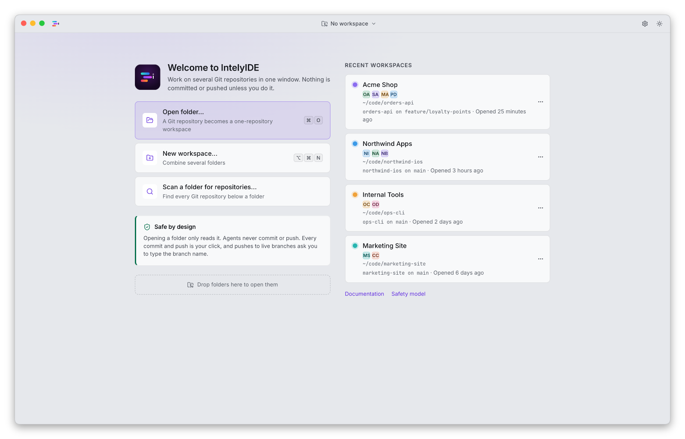</picture>

## Requirements

- macOS 13.5 or later. Intel x64 build for now; Apple Silicon runs it under Rosetta 2.
- `git` 2.30 or newer (the push path uses `--force-if-includes`), for example from the Xcode Command Line Tools.
- For agent features: Node.js 24 or newer, and your own Claude Code (`claude` command-line tool) installed and logged in. Claude Code is not bundled and is not part of this project.
- For agent features: the Claude Agent SDK, which you install yourself under Anthropic's terms. See [docs/getting-started.md](docs/getting-started.md).
- Without Node and Claude Code, the Git features work and the agent features stay unavailable. The disk image contains the agent sidecar (the 0.1.0 pre-release image did not), but not Node, Claude Code or the Agent SDK.

## Build from source

```sh
git clone https://github.com/ferencfarkas09/IntelyIDE.git
cd IntelyIDE
corepack enable
pnpm install --frozen-lockfile
pnpm dev:app
```

You need the Xcode Command Line Tools, Rust 1.96 or newer, Node.js 24 and pnpm 11. `pnpm dev:app` builds a debug version and starts it read-only. `pnpm install` also fetches the proprietary Claude Agent SDK as a development dependency of the sidecar, under Anthropic's terms. The first build takes 30 minutes or more on an Intel laptop and needs several gigabytes of disk. Other launch modes are described in the header of `scripts/dev.sh`; details are in [docs/building.md](docs/building.md).

## Configuration

- Settings and the workspace registry live in one state folder under `~/Library/Application Support/`. Version 1.2.0 still uses the folder name `IntelySwitchIDE`; a rename to `IntelyIDE` with a migration is planned. The Agent SDK you install lives in its own folder, `~/Library/Application Support/IntelyIDE/sdk`. See [docs/privacy.md](docs/privacy.md) for every file.
- Optional modules (Remote, MongoDB Studio, Happy) are off until you switch them on in Settings.
- Environment variables that change safety behaviour: `INTELY_READONLY` (refuse writes) and `INTELY_WRITABLE` (allow writes when started with `pnpm dev:app`).
- To uninstall: move the app to the Trash, delete the state folder (this removes run logs and the refusals log), delete the Keychain items of the app in Keychain Access, and remove Rewind refs from your repositories with `git for-each-ref refs/intely/` and `git update-ref -d <ref>`.

## Privacy

IntelyIDE has no telemetry: no usage data, no analytics, no crash reports and no account. It makes network requests only where you turned something on: `git` talks to your remotes, your own `claude` installation talks to its vendor, the servers you add under Settings > Servers are reached through your own `ssh`, and the optional modules you enable (Remote, MongoDB Studio, Happy) talk to the servers you configure. Once a day, after a one-time notice, it asks GitHub whether a newer release exists (one request that carries no data about you; switch it off in Settings > Updates). The run log and the refusals log are plain text on your disk and can contain file contents and command lines. What is stored where, and what is not verified: [docs/privacy.md](docs/privacy.md).

## FAQ

- **Does it replace my editor?** No. It has a small built-in editor, but it is a Git client first.
- **Can the agent push?** It is fenced off by layered, best-effort protections, not by a guarantee. See the safety model above.
- **What does it send over the network?** See Privacy above.
- **Why does macOS say it cannot verify the app?** The build is ad-hoc signed and not notarized. See Install.
- **Does it run on Apple Silicon?** Yes, under Rosetta 2, more slowly. A native build is not available yet.
- **Why does it need my own Claude installation?** It drives your local `claude` and does not bundle or proxy it.
- **Is it affiliated with Anthropic?** No. See License.
- **How do I report a vulnerability?** Privately, as described in [SECURITY.md](SECURITY.md).

More questions and troubleshooting: [docs/faq.md](docs/faq.md).

## Documentation

| Document | What it covers |
|---|---|
| [Getting started](docs/getting-started.md) | Run modes, workspaces, a first commit in a scratch repository, agent setup |
| [Install on macOS](docs/install-macos.md) | The DMG, the first-launch prompt, Rosetta 2, uninstall |
| [FAQ and troubleshooting](docs/faq.md) | Common questions, logs, resetting state |
| [Safety model](docs/safety.md) | The layers, their limits and how they are tested |
| [Privacy](docs/privacy.md) | What is stored and what leaves your machine |
| [Runs on servers](docs/remote-servers.md) | Running agents on your own servers over ssh |
| [Notifications](docs/notifications.md) | Banners and the Dock count |
| [Architecture](docs/architecture.md) | Crates, sidecar, UI and data flow |
| [Building](docs/building.md) | Building from source and running tests |
| [All documents](docs/README.md) | The full index |

## Contributing

Read [CONTRIBUTING.md](CONTRIBUTING.md) first: contributions are signed off with `git commit -s` (Developer Certificate of Origin), and AI-assisted contributions must be disclosed. Please follow the [Code of Conduct](CODE_OF_CONDUCT.md). The changes of each release are in [CHANGELOG.md](CHANGELOG.md).

- Pull requests are welcome. The maintainer reviews and approves every pull request manually; a review is required before anything is merged.
- Bugs and feature requests: [GitHub Issues](https://github.com/ferencfarkas09/IntelyIDE/issues).
- Questions and ideas: [GitHub Discussions](https://github.com/ferencfarkas09/IntelyIDE/discussions). More in [SUPPORT.md](SUPPORT.md).
- Security reports: privately, through [GitHub's private vulnerability reporting](https://github.com/ferencfarkas09/IntelyIDE/security/advisories/new), as described in [SECURITY.md](SECURITY.md).
- The project's website is [intelyhome.com](https://intelyhome.com).

## License

IntelyIDE is free software, released under the GNU General Public License, version 3 or (at your option) any later version (SPDX: `GPL-3.0-or-later`). It comes with ABSOLUTELY NO WARRANTY.

- The license text is in [LICENSE](LICENSE). Third-party components and their licenses are listed in [THIRD_PARTY_LICENSES.md](THIRD_PARTY_LICENSES.md) and in the app under About, Open-source licenses.
- Copyright (c) 2026 Ferenc Farkas (IntelyHome) and IntelyIDE contributors.
- The name IntelyIDE, the project's other names and the logo are not covered by the GPL; see [TRADEMARKS.md](TRADEMARKS.md).
- Claude Code and the Claude Agent SDK are separate, proprietary Anthropic software that you install under Anthropic's own terms. They are not part of this project's license.

Not affiliated with, endorsed by or sponsored by Anthropic. "Claude" and "Anthropic" are trademarks of Anthropic.

## Acknowledgements

Built with Tauri, SolidJS, Rust and Git. The Sora typeface (SIL OFL 1.1) informed the logo. The open-source crates and packages the app uses are listed in [THIRD_PARTY_LICENSES.md](THIRD_PARTY_LICENSES.md). Claude Code and the Claude Agent SDK are separate Anthropic software that you install yourself. The Commit and Push windows of JetBrains IDEs informed the workflow; JetBrains is not affiliated with this project.
