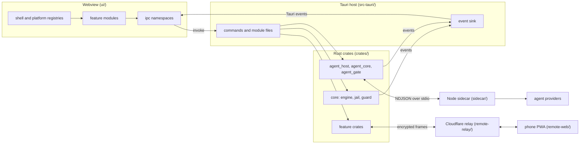

# Architecture

This document explains how IntelyIDE is put together: which crates and packages exist, how a commit and an agent run travel through them, what is stored on disk and how the test suites are organised.

Applies to version 1.2.0.

IntelyIDE is a desktop app built with Tauri. A Rust engine does the Git work, a SolidJS interface shows it, and a lazily started Node process (the sidecar) talks to AI coding agents. The safety rules that constrain every layer are described in [safety.md](safety.md).

## Overview

Everything that needs no window lives in a Tauri-free crate, so `cargo test` runs without a webview. The Tauri layer in `src-tauri/` only wraps those crates in commands and forwards their events to the interface.

## Repository layout

| Path | Role |
|---|---|
| `crates/` | The Rust workspace: engine, agent layer and feature backends (next section). |
| `src-tauri/` | The desktop app: window, menu, tray, one command module per feature under `src-tauri/src/modules/`. |
| `ui/` | The SolidJS interface (Vite, TypeScript). |
| `packages/protocol/` | The shared agent protocol types (see below). |
| `sidecar/` | The Node process that hosts agent providers. |
| `remote-relay/` | The Cloudflare Worker and Durable Object used by Remote. |
| `remote-web/` | The phone web app for Remote. |
| `scripts/` | Build, end-to-end, licence and release tooling. |
| `site/` | The static project site. |
| `fixtures/` | Recorded provider streams and policy fixtures used by tests. |

## Crates by role

All crates live in `crates/<name>`; the Cargo package names carry an `intely-` prefix.

### Engine and Git

| Crate | What it does |
|---|---|
| `core` | The Git engine without Tauri: repository actors, status, diff, commit, push, pull, the jail (`jail.rs`), the commit guard (`guard.rs`) and the workspace registry. |
| `gitx` | The pull request bridge on the GitHub CLI and the extended Doctor checks. |
| `graph` | The multi-repository commit graph, blame, interactive rebase, cherry-pick and branch matrix. |
| `pathpick` | The folder picker core: path validation, read-only listing, one-time tokens and a bounded scan. |

### Agents

| Crate | What it does |
|---|---|
| `agent_core` | Provider-neutral types and logic: normalized events, the event log and bus, the permission broker (`policy/`), the agent hub trait and the sidecar wire messages. |
| `agent_gate` | The process gate (leases, memory limits, cancel), Rewind snapshots and the allow-list Git shim given to each run. |
| `agent_host` | The host that ties it together: starts the sidecar, runs the NDJSON loop, routes policy decisions, writes the event log and prepares each run. |
| `servers` | Runs on your own servers: validation of a server entry, quoting, the system `ssh` binary (no ssh library), the probe and setup of a server (Node.js, the IDE's agent files, the Agent SDK, Claude Code), repositories there, and the git guard upload. No async runtime. |
| `roles` | Roles and run history: what a role may do, and the data behind the runs views. |
| `runindex` | A read-only consumer of the run logs: session search, the night queue and the morning brief. |

The sidecar itself is not a crate; it is the Node package in `sidecar/`.

### Modules

| Crate | What it does |
|---|---|
| `files` | File tree, editor reads and writes, quick open, search, branches, stash and rollback. |
| `term` | Pseudo-terminal sessions. |
| `settings` | The versioned settings store, the secret store and the provider registry. |
| `mongo` | MongoDB Studio core: a read-only command set, a literal parser and an explain walker. The driver sits behind the `mongo` cargo feature. |
| `remote` | The Remote gateway: encrypted supervision of agent runs from a phone, device capabilities, an audit trail and a kill switch. The end-to-end claim rests on the Rust reference implementation; interop vectors with the phone bundle are not produced yet (`docs/remote-gateway.md`). |
| `relay_bundle` | Stages and signs the phone web bundle, generates signing and push keys, and checks a deployed relay. |
| `relay_deploy` | Finds the relay kit and deploys it to your own Cloudflare account through a pinned `wrangler`, with output masking. |
| `happy` | An optional integrations framework (allow-listed HTTP client, scheduler, providers) used for team tools. It does nothing until you configure a provider. |
| `preview-proxy` | A loopback reverse proxy for the embedded preview that injects the click-to-source inspector. |
| `runner` | Script discovery with safety classification, and managed dev-server processes with masked logs. |
| `checks` | Pre-commit checks, environment and secret awareness, branch hygiene and the worktree manager. |
| `contract` | API contract drift detection and the API explorer logic. |
| `l10n` | The localisation checker and release assistant. |
| `attachments` | The attachment store: dropped, pasted and picked files are copied into the state directory. |
| `hud` | The resource HUD, the menu-bar logic and the notification gate (which banners may show, how often). |
| `updater` | Verified in-app updates, planned for a later version. Built so far: the signed feed and signature check, the hardened download and the guarded unpack and stage; the atomic swap, rollback, check scheduler and Settings page are not wired in yet. |

## Protocol package

`packages/protocol` holds the TypeScript view of the agent protocol. The types under `src/generated/` are produced from the Rust definitions in `agent_core` by `pnpm protocol:gen`, together with the fixtures the TypeScript tests parse. Hand-written files next to them add parsing that fails closed (`failclosed.ts`), invariant checks (`invariants.ts`) and the intent and batch helpers. Both the interface and the sidecar depend on it, so the two sides of the NDJSON channel share one definition.

## User interface

The interface is in `ui/src`:

| Folder | Role |
|---|---|
| `app/`, `shell/` | Application root, window layout, rail, title bar and close guard. |
| `platform/` | Registries a module adds to: rail items, tabs, commands, keyboard shortcuts, settings sections, status bar items, editor extensions, overlays and the Inspector panels. |
| `modules/` | One folder per feature module. |
| `ipc/` | The typed bridge to Rust. Each namespace has a Tauri implementation and a deterministic mock used in the browser and in tests. |
| `bindings/` | Types generated from Rust by `pnpm bindings`. |
| `store/` | Shared reactive state. |
| `ui-kit/`, `theme/` | The component kit and design tokens (see [design-system.md](design-system.md)). |
| `i18n/` | Locale catalogs; see [i18n.md](i18n.md). |

## Module gating

A feature module is a folder under `ui/src/modules/` whose `index.ts` exports a `register()` function. `ui/src/modules/index.ts` lists every module in one array and calls each `register()` inside a `try`. Three rules keep a module cheap and contained:

- `register()` only fills registries. It does no IPC, starts no timers and opens no sockets, so a module that is switched off costs nothing at startup.
- Visibility is reactive. Modules such as Remote and the integrations hide their commands and status items with a `when` condition that reads settings, so they appear only when turned on.
- A module that throws while registering is logged and skipped; the rest of the app starts.

On the Rust side each feature has its own file in `src-tauri/src/modules/`. MongoDB Studio is additionally behind the `mongo-studio` cargo feature, which is on by default. A build without it leaves out the driver and its TLS stack.

## Data flow of a commit

1. The Commit panel sends `commit_start` through the `ipc` layer with the selected repositories, files and message.
2. The Tauri command in `src-tauri/src/commands.rs` calls `Engine::commit_start` in `crates/core/src/engine.rs`.
3. For every repository the engine asks the jail whether `commit_start` is allowed (`Jail::check_op`), then runs the commit guard over the staged files. A blocked file rejects the whole request before anything runs.
4. Each repository is handled by its own actor. The commit work is queued on the write lane of that actor, so two writes to one repository never overlap.
5. `crates/core/src/git/commit.rs` stages the chosen files, runs the repository hooks unless the request skips them, and creates the commit.
6. Progress arrives in the interface as `op:event` messages and the final outcome as `op:result`, both forwarded by the sink in `src-tauri/src/sink.rs`. A push follows the same path and adds the live-branch confirmation described in [safety.md](safety.md).

## Data flow of an agent run

1. The runs module starts a run through its `ipc` namespace; the Tauri command passes the request to `AgentHost` in `agent_host`.
2. The host builds the run's environment from an allow-list, takes a lease from the process gate in `agent_gate`, takes a Rewind snapshot of the working tree under `refs/intely/snapshots/` and prepares a per-run Git shim that only permits allow-listed Git commands.
3. The host starts the sidecar if it is not running and sends the run over NDJSON on stdio. The sidecar loads the chosen provider adapter (the Claude SDK, an ACP client or the mock) and streams provider messages back.
4. `agent_core` normalises those messages into provider-neutral events. When an agent wants to use a tool, the permission broker decides in a fixed order: hard stop, role deny, saved allow, ask. Anything it cannot judge becomes a question for you; a broken channel becomes a denial.
5. Every event is appended to the run log first and published second (`EventBus`), so no subscriber sees an event the log does not hold.
6. The sink forwards events to the webview. If Remote is on, the gateway subscribes to the same hub, so a phone and the desktop use one code path. Your answer to a permission request resolves it exactly once.
7. On cancel or completion the gate releases the lease and the host cleans up the run. Rewind can later restore the snapshot.

### Runs on a server

A run placed on a server (Settings > Servers) goes through the same steps with these differences. The host keeps one sidecar per server, started with `ssh <server> ... node index.js`, and speaks the same NDJSON protocol over the ssh pipe; the Claude CLI and every tool call run on the server, in its copy of the repositories. The permission broker stays in the IDE: a decision that needs a file of the server asks the sidecar there through `fs/query` (`crates/agent_core/src/policy/fsrpc.rs`, `sidecar/src/fsquery.ts`), and one that cannot get an answer is denied. The git guard is made for the server's git and uploaded per run. A run takes no slot of this Mac's gate; its limit is the server's `maxAgents`, a finished run gives up its place to a new one, and an idle session is closed after ten minutes. See [remote-servers.md](remote-servers.md) and the section "Runs on a server" in [safety.md](safety.md).

## State storage

| Location | Content |
|---|---|
| `~/Library/Application Support/IntelyIDE/` (`state_dir()` in `crates/settings/src/store.rs`; development builds currently use `IntelySwitchIDE`) | Settings, the workspace registry, trust and live-branch marks, usage and policy bookkeeping, the Remote device list and audit trail. |
| `<state dir>/runs/<agentId>.jsonl` | The event stream of each run, written by `crates/agent_core/src/events/log.rs`. It is plain text and not redacted. |
| macOS Keychain | Provider tokens, integration tokens and per-connection database credentials. |
| `.git` of your repositories | Rewind snapshot refs under `refs/intely/snapshots/`. |
| Webview local storage | Interface preferences such as the language. |
| `~/.intely/` on each server | The IDE's agent files, Node.js and Claude Code (if installed from Settings > Servers) and the git guard of each run there. |

The complete, code-cited list is in [privacy.md](privacy.md).

## Testing strategy

- **Rust crates:** unit and fixture tests, run per crate with `cargo test -p <package>`. Tests that touch Git build their repositories in temporary directories and never use a real checkout.
- **Interface:** Vitest in `ui/` (`pnpm test` inside that folder), using the `ipc` mocks so no backend is needed.
- **Protocol and sidecar:** Vitest in `packages/protocol` and `sidecar`. The protocol tests parse fixtures generated from Rust, which catches drift between the two languages. Recorded provider streams live in `fixtures/golden`.
- **Remote:** `remote-relay` runs Node tests against a local Worker; `remote-web` runs Vitest. Neither contacts Cloudflare.
- **End to end:** `scripts/e2e/run.sh` starts a development build of the real app against fresh fixture workspaces and asserts the result through Git.
- **Safety:** the jail honours `INTELY_E2E` and `INTELY_READONLY`, so automated runs cannot mutate real repositories. See [safety.md](safety.md).
- **Release tooling:** `pnpm release:test` and `pnpm licenses:test` cover the checkers for documentation, licences and the public file set.

For build prerequisites and the exact commands see [building.md](building.md).
